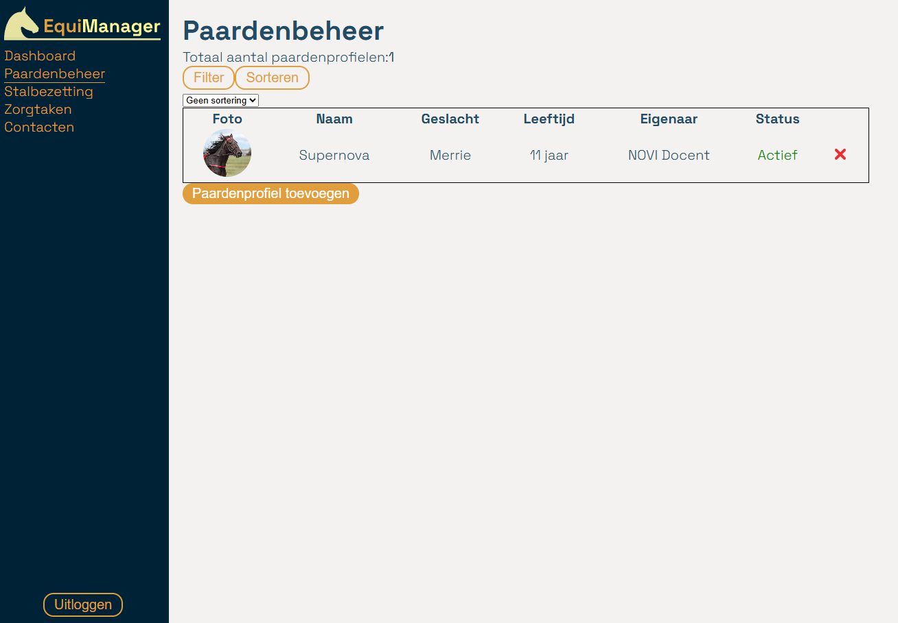
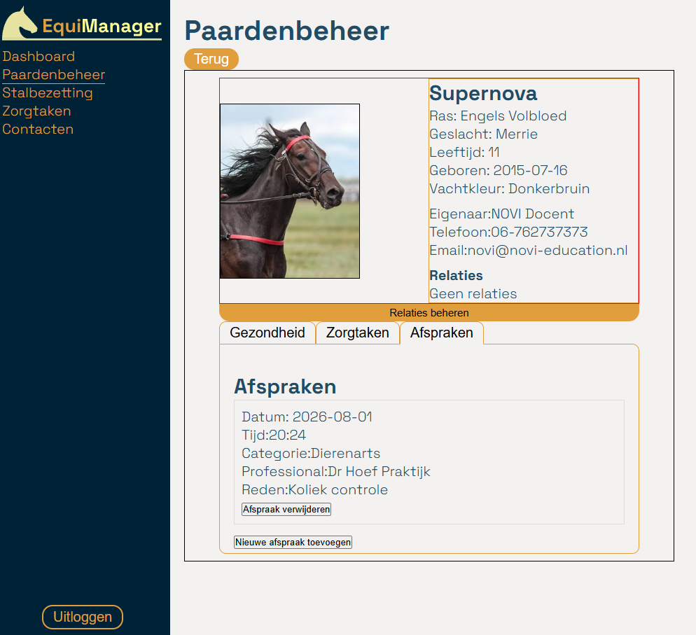
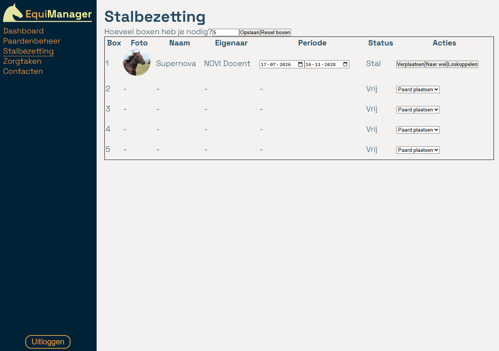

# EquiManager handleiding

## Inhoudsopgave
1. Inleiding
2. Gebruikte technieken en frameworks
3. Installatie en lokaal uitvoeren van de applicatie
4. Beschikbare testaccount
5. beschikbare npm commando's

### 1. Inleiding
Deze applicatie is ontwikkeld voor stalhouders om het beheer van paarden en dagelijkse werkzaamheden rondom stal overzichtelijk te maken. De gebruiker kan paarden, contacten en zorgtaken beheren, relaties koppelen en afspraken bijhouden.

Het doel van de applicatie is om alle onderdelen rondom paardenbeheer op één centrale plek samen te brengen zodat de stalhouder eenvoudig inzicht heeft op gezondheid, verzorging en planning rondom paarden.

#### Functionaliteiten
- Gebruikersregistratie en inloggen
- Beheren van paardenprofielen
- Beheren van contactprofielen
- Beheren van zorgtaken
- Contactprofielen koppelen aan (meerdere) paardenprofielen
- Beheren van stalbezetting
- Beheren van afspraken met professionals zoals hoefsmeden en dierenartsen
- Dashboard-overzicht van aantal paarden op stal en in de wei, openstaande afspraken en zorgtaken.

### 2. Dependencies
Deze dependencies heb je nodig om de applicatie kunnen draaien

#### Frontend
**React**
De applicatie is gebouwd met React. Er is gekozen voor React omdat de applicatie uit veel herbruikbare onderdelen bestaat zoals formulieren, kaarten en secties. Hierdoor kunnen onderdelen afzonderlijk aangepast worden.

Er is gebruikgemaakt van `useState`, `useEffect` en `useContext`

#### API
**Axios**
Axios  wordt gebruikt voor het versturen van http verzoeken naar de backend zoals het ophalen van paarden, contacten of het aanmaken van afspraken, aanpassen van relaties en het opslaan van zorgtaken

#### Routing
** React Router DOM**
Het wordt gebruikt om verschillende pagina's binnen de applicatie te beheren. Hierdoor kan de gebruiker navigeren tussen verschillend pagina's zonder dat heel de applicatie geladen moet worden.

#### Styling
**CSS**
De meeste componenten die styling nodig hebben, zijn gekoppeld aan hun eigen CSS.

### 3. Installatie en lokaal uitvoeren van de applicatie

Vereisten:
- Git
- Node.js

1. Clone de repository:
   `git clone git@github.com:WhitneyWassenaar/eindopdracht-whitneywassenaar-frontend-02-2026.git`

2. Ga naar de projectmap:
   `cd eindopdracht-whitneywassenaar-frontend-02-2026`

3. Installeer de benodigde dependencies:
   `npm install`

4. Start de applicatie:
   `npm run dev`

Bij het inleveren is een `.env`bestand toegevoegd. Dit bestand bevat configuratie waaronder ook de API URL.

### 4. Beschikbare testaccount
Gebruikersnaam: docent@novi-education.nl  
Wachtwoord: noviEducation@123

### 5. beschikbare npm commando's
- **npm install**  
  Installeert alle dependencies uit package.json.

- **npm run dev**  
  Start de ontwikkelserver zodat de applicatie lokaal bekeken kan worden.

